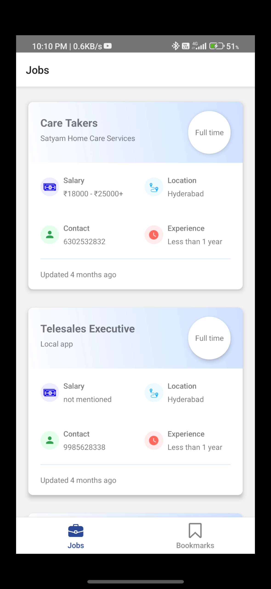
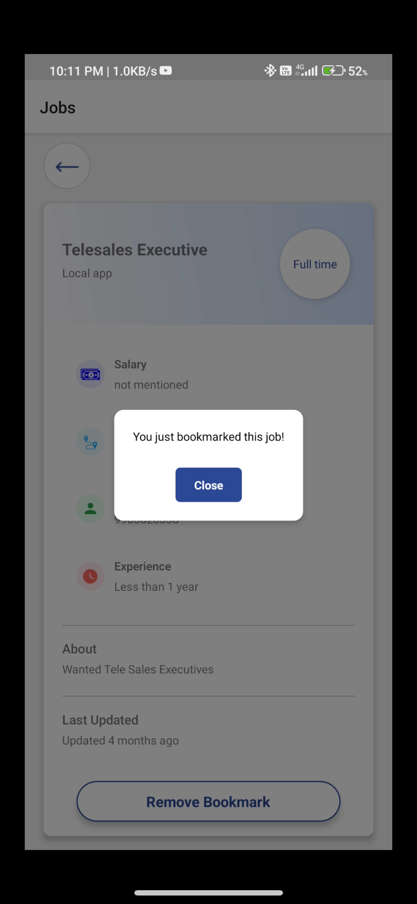
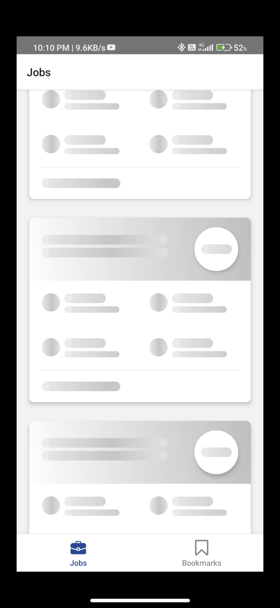
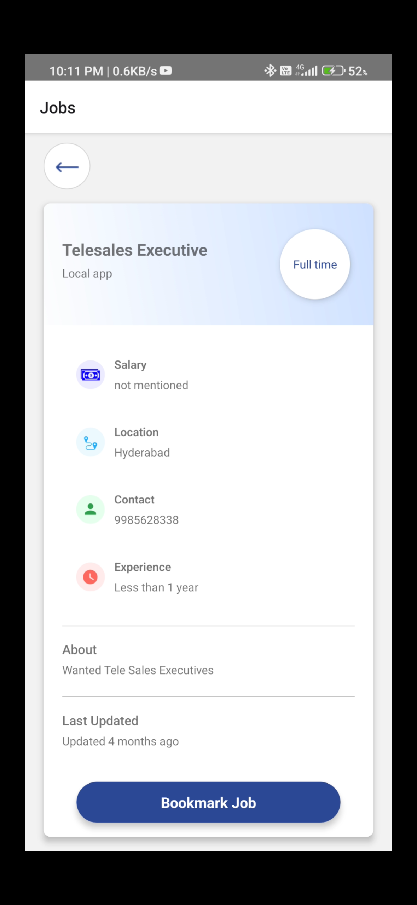

# Job Bookmark App

## Overview

This React Native app allows users to browse job listings with features such as infinite scrolling, bookmarking jobs, and viewing detailed job information.

## Demo






## Features

- _Shimmer Effect_: Upon loading the app, a shimmer effect is displayed on job cards while fetching data from the API.
- _Job Listings_: Jobs are rendered using a FlashList.
- _Job Details_: Clicking on a job card navigates the user to a detailed view of the job with an option to bookmark/unbookmark.
- _Bookmarking_: Bookmarked jobs are stored locally using Redux Persist and AsyncStorage, ensuring availability even offline.
- _Infinite Scrolling_: Implemented using useInfiniteQuery from React Query to handle pagination seamlessly.
- _Custom Modal Component_: Created a custom modal for user interactions and alerts.
- _Code Quality_: Followed TypeScript for type safety, handled loading states, API errors, and failures effectively. Used react.memo for optimizing performance where necessary etc.

## Installation and Usage

To run the app locally on android, follow these steps:

1. Clone the repository:

   ```bash
   https://github.com/sargunkohli152/JobBookmarkApp.git
   ```

2. Navigate to the project directory:
   ```bash
   cd JobBookmarkApp
   ```
3. Install dependencies:
   ```bash
   npm install
   ```
4. Connect to an android emulator or physical android device
5. Generate build and run metro server
   ```bash
   npm run android
   ```

## Technologies Used

- React Native
- React
- TypeScript
- Redux Persist
- AsyncStorage
- React Query

## Contributing

Contributions are welcome! If you find any bugs or have suggestions for improvement, please feel free to open an issue or submit a pull request.

## License

This project is licensed under the MIT License
